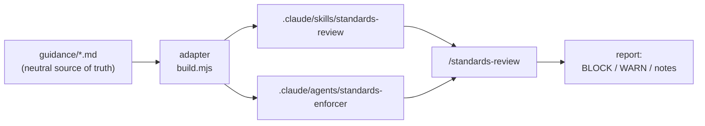
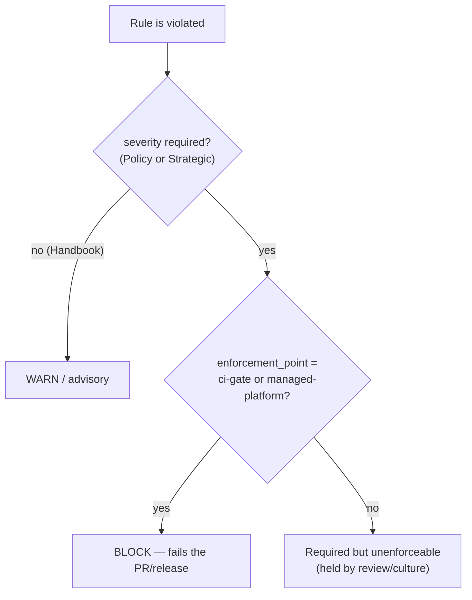
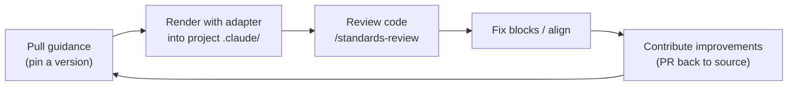

# How to use this in your organization

This guide is for someone adopting `org-engineering-config` in a **new organization**: how to set it
up, get started, confirm it's working, and think about rolling it out at scale. No prior context
assumed.

> **What you adopt is the mechanism**, not the bundled rules. The rules under `guidance/` are a
> **proof-of-concept sample** that ships so you can see the pipeline work end-to-end; a real
> organization replaces them with its own authored rules. Everywhere below, "the guidance" means
> *whatever rule-set you point the adapter at* — the sample today, your own once you fork it.

If you just want the mental model first, read the [README](../README.md); the rule format is in
[`GUIDANCE-SCHEMA.md`](GUIDANCE-SCHEMA.md), and how to propose changes is in
[`CONTRIBUTING.md`](../CONTRIBUTING.md).

## The idea in one picture

The guidance is a **neutral source** — plain markdown + metadata, tied to no tool. An **adapter**
renders it into a specific tool's packaging (today, Claude Code). Your project consumes the rendered
packaging; you never hand-write the tool config.



## What actually blocks

Two axes decide it. A rule **blocks** only when it is *required* **and** caught at a *central gate*.
Everything else warns, is caught after the fact, or relies on people — and the model says so honestly
instead of pretending.



A third axis, `agent_action`, tells an AI coding agent its *role* on each rule: **enforce** (fix it as
you write), **align** (comply; the gate is elsewhere), or **aware** (surface it; you can't
self-satisfy it).

## Get started (5 minutes)

1. **Pull the guidance.** For a pilot, work from this repo directly; at scale, vendor it as a git
   submodule or a pinned copy so a version is reproducible.

2. **Render the reviewer into your project** (writes only under your project's `.claude/`, never your
   global `~/.claude`):

   ```bash
   node adapters/claude-code/build.mjs --out /path/to/your-project
   ```

   This validates every rule, then generates:
   - `.claude/skills/standards-review/SKILL.md` — the `/standards-review` skill
   - `.claude/skills/standards-review/rules.md` — the compiled rule catalog
   - `.claude/agents/standards-enforcer.md` — a subagent for deeper audits

3. **Review your code.** In your project, run the skill:

   ```
   /standards-review
   ```

   It reviews your current diff (or the whole repo), and reports findings grouped **BLOCK → WARN →
   notes**, ending in a `PASS` or `BLOCKED — n` verdict. For a deep multi-file audit, hand off to the
   `standards-enforcer` subagent.

4. **Re-render when the guidance changes.** Re-running the adapter is the "pull the current standards"
   step — new and changed rules flow into your project with no edits to the reviewer.



## How I know it's working

Don't take it on faith — the repo ships a **known-good** and a **known-bad** app so you can see the
reviewer succeed and fail on purpose.

- **[`examples/conforming-app`](../examples/conforming-app)** is written to satisfy the rules. Running
  `/standards-review` against it returns **`PASS` — zero BLOCK findings**. (Its tests also pass:
  `cd examples/conforming-app && node --test`.)
- **[`examples/violating-app`](../examples/violating-app)** plants one violation per severity band.
  Running `/standards-review` against it returns a **`BLOCKED`** verdict — at least the three
  `ci-gate` violations below, and often related findings the reviewer derives (e.g. a skipped-only
  suite failing `qual-unit-test-coverage`). Exact counts vary with the review:

  | Finding | Rule | Result |
  |---|---|---|
  | hardcoded secret (`src/config.mjs`) | `sec-no-plaintext-secrets` (Policy · ci-gate) | **BLOCK** + cites `SOC2 CC6.1`, `ISO 27001 A.9.2.3`, `NIST SP 800-53 IA-5` |
  | local SQLite (`src/db.mjs`) | `arch-no-local-sql-databases` (Strategic · ci-gate) | **BLOCK** |
  | skipped test (`test/server.test.mjs`) | `qual-no-skipped-tests` (Strategic · ci-gate) | **BLOCK** |
  | unpinned CI action (`ci.yml`) | `integ-pin-third-party-actions` (Handbook · ci-gate) | **WARN** |
  | PII in a log (`src/server.mjs`) | `obs-no-pii-in-logs` (Strategic · audit) | required, unenforceable — surfaced, not blocked |

**Your self-check on a real repo:** render the reviewer into a clean project → expect `PASS`. Then
plant one obvious violation (commit a fake `API_KEY = "..."`), re-run → expect a **BLOCK** finding that
names the rule and cites its control IDs. If both hold, the pipeline is wired end-to-end.

**The wiring is decoupled, on purpose.** Edit a rule in `guidance/` and re-render — the reviewer picks
it up with no code change. Verified behaviors: adding a rule increases the catalog; flipping a rule
`Handbook → Strategic` turns a WARN into a BLOCK; moving its `enforcement_point` from `human-review`
to `ci-gate` makes a required-but-unenforceable rule start blocking; a new Policy `references` entry
shows up in the report. The reviewer never changes — only the source does.

## Scaling the rollout (design notes)

The pilot proves the loop on two apps. Taking it org-wide adds concerns this repo names but has not
yet built — plan for them:

- **Distribution & pinning.** How teams *pull*: a submodule or a published package, each project
  pinning a version, with a CI **freshness gate** that fails a PR when it drifts behind the promoted
  `stable` release, plus a scheduled **bump bot** (the lockfile model in the README). *Not yet built.*
- **Applicability / scoping.** Today all rules apply to every project. A real org needs `applies_to`
  scoping — which rules bind a static site vs. a data service vs. a mobile app — so the reviewer isn't
  noisy. **This is the top post-pilot gap.**
- **Ownership.** Each rule/domain needs an accountable owner (a CODEOWNERS-style mapping or an `owner`
  field) so changes are reviewed by the right people.
- **Exceptions / waivers.** A sanctioned, time-boxed deviation path (approver + expiry) so "we can't
  comply yet" is recorded, not silently ignored — richer than today's prose `## Exceptions`.
- **The managed-platform tier.** True non-overridable enforcement (`enforcement_point:
  managed-platform`) for the rules that must never be bypassed, built on tool-level managed settings.
- **Reporting.** Which teams are current, violation trends over time — so adoption is measurable.

Suggested rollout order: (1) pilot on a few willing teams with the reviewer as advisory; (2) turn on
the CI freshness gate for `Policy`/`Strategic` rules; (3) add `applies_to` scoping and the waiver
path; (4) promote the managed-platform tier for the non-negotiable rules.

> A note on scope: keep the generated reviewer **project-scoped** (each project's `.claude/`). It is
> deliberately not installed into anyone's global profile — the standard belongs to the org and its
> projects, not to an individual's personal setup.
